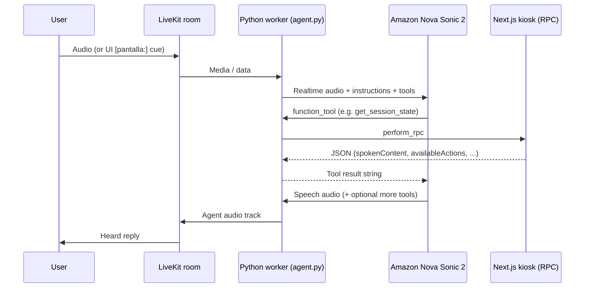

<a href="https://livekit.io/">
  
</a>

# Huella Guide — LiveKit Python Agent

Voice guide for the **SETI Huella Digital** kiosk. This is a [LiveKit Agents](https://github.com/livekit/agents) Python worker that joins a LiveKit room, listens/speaks with **Amazon Nova Sonic 2** (AWS Bedrock realtime), and drives the Next.js UI through **client RPC tools**.

Companion frontend: `huella-digital` (registers the matching RPC methods on the browser participant).

**Deep dive (connection, UI/UX rendering, voice → elements, business logic):**  
[VOICE_UI_DEEP_DIVE.md](./VOICE_UI_DEEP_DIVE.md)

---


## How the agent is built (Python)

Everything that runs in production lives in `src/`. The live path is intentionally small: one entry file, one agent class, one RPC helper.

```
src/
├── agent.py          # Entrypoint: AgentServer, Nova Sonic session, Assistant tools
├── rpc_client.py     # LiveKit perform_rpc → kiosk frontend
└── tasks/            # Legacy phase tasks (not used by the current Nova path)
```

### 1. Entrypoint and process model

`src/agent.py` is both the library and the CLI entrypoint:

```python
server = AgentServer()

@server.rtc_session(agent_name=AGENT_NAME)
async def my_agent(ctx: JobContext):
    ...

if __name__ == "__main__":
    cli.run_app(server)
```

| Piece | Role |
|-------|------|
| `AgentServer` | Long-running worker that connects to LiveKit and accepts jobs |
| `@server.rtc_session(agent_name=...)` | Job entrypoint when a room requests this agent by name |
| `cli.run_app(server)` | Starts the worker (`console` / `dev` / `start`) |
| `JobContext` (`ctx`) | Room handle, logging fields, and `ctx.connect()` to join media |

Agent name comes from env (default `huella-guide`):

```python
AGENT_NAME = os.getenv("LIVEKIT_AGENT_NAME", "huella-guide")
```

The frontend (or dispatch rules) must request that same name so this worker is assigned to the room.

### 2. Environment and config

On import, credentials are loaded from `.env.local`:

```python
from dotenv import load_dotenv
load_dotenv(".env.local")
```

| Variable | Purpose | Default |
|----------|---------|---------|
| `LIVEKIT_URL` | LiveKit Cloud WebSocket URL | — |
| `LIVEKIT_API_KEY` / `LIVEKIT_API_SECRET` | Worker auth | — |
| `LIVEKIT_AGENT_NAME` | Dispatch name | `huella-guide` |
| `AWS_ACCESS_KEY_ID` / `AWS_SECRET_ACCESS_KEY` | Bedrock (Nova Sonic) | — |
| `AWS_REGION` | Bedrock region | `us-east-1` |
| `NOVA_VOICE` | Spanish voice: `lupe` or `carlos` | `lupe` |
| `NOVA_TURN_DETECTION` | `HIGH` / `MEDIUM` / `LOW` | `MEDIUM` |

See `.env.example`. Without AWS keys the session still starts, but Bedrock calls fail (a warning is logged).

### 3. Voice stack: Amazon Nova Sonic 2 (realtime)

This agent does **not** use a separate STT → LLM → TTS pipeline. It uses one **realtime** model that handles audio in and out:

```python
def _build_nova_realtime() -> aws.realtime.RealtimeModel:
    return aws.realtime.RealtimeModel.with_nova_sonic_2(
        voice=NOVA_VOICE,
        turn_detection=NOVA_TURN_DETECTION,
        region=AWS_REGION,
        tool_choice="auto",
        generate_reply_timeout=20.0,
    )
```

| Setting | Meaning |
|---------|---------|
| `with_nova_sonic_2(...)` | LiveKit AWS plugin helper for Nova Sonic 2 |
| `voice` | Spoken Spanish persona (`lupe` / `carlos`) |
| `turn_detection` | How aggressively Nova ends the user turn |
| `tool_choice="auto"` | Model may call tools when needed (set on the model, not per reply) |
| `generate_reply_timeout=20.0` | Wait up to 20s for a reply generation |

Dependencies (`pyproject.toml`):

- `livekit-agents` — core Agent / AgentSession / CLI
- `livekit-plugins-aws[realtime]==1.7.0` — Nova Sonic realtime, pinned while
  `src/nova_session_continuation.py` provides the recycle-timer compatibility fix
- `aws-sdk-bedrock-runtime` — Bedrock runtime client
- `livekit-plugins-ai-coustics` — noise / voice enhancement on mic input
- `python-dotenv` — `.env.local`

### 4. Session wiring

Inside the RTC session entrypoint:

```python
session = AgentSession(
    llm=_build_nova_realtime(),
    max_tool_steps=4,
)

await session.start(
    agent=Assistant(),
    room=ctx.room,
    room_options=room_io.RoomOptions(
        audio_input=room_io.AudioInputOptions(
            noise_cancellation=ai_coustics.audio_enhancement(
                model=ai_coustics.EnhancerModel.QUAIL_VF_L
            ),
        ),
    ),
)

await ctx.connect()
```

Flow:

1. Build an `AgentSession` whose `llm` is the Nova realtime model.
2. Cap tool chaining at **4** steps per turn (`max_tool_steps=4`).
3. Start the session with a fresh `Assistant()` and attach room I/O.
4. Enhance inbound audio with **ai_coustics** (`QUAIL_VF_L`) before Nova hears it.
5. `ctx.connect()` joins the LiveKit room and media can flow.

Nova handles barge-in / interruption itself; there is no separate VAD/STT/TTS pipeline in this file.

### Nova stream continuation

AWS closes an individual Nova Sonic realtime stream after roughly eight minutes.
`NOVA_SESSION_REFRESH_SECONDS` defaults to `360`, so the agent replaces only the
internal Bedrock stream while the LiveKit room and participant remain connected.

LiveKit AWS 1.7.0 can cancel the task performing that replacement when it arms
the next recycle timer. `src/nova_session_continuation.py` installs a narrow,
version-gated fix before any realtime session is created. After a successful
renewal, logs should include all of the following:

```text
[SESSION] Armed next Nova recycle timer without cancelling the active renewal
[SESSION] Session recycled successfully
Starting audio input processing loop
```

Review and remove the compatibility module before upgrading
`livekit-plugins-aws`; the application intentionally refuses to start with an
untested plugin version.

Logging context is attached for observability:

```python
ctx.log_context_fields = {
    "room": ctx.room.name,
    "agent": AGENT_NAME,
    "voice_backend": "nova",
    "voice_model": "amazon.nova-2-sonic",
    "nova_voice": NOVA_VOICE,
}
```

### 5. The `Assistant` agent class

```python
class Assistant(Agent):
    def __init__(self) -> None:
        super().__init__(instructions=NOVA_INSTRUCTIONS)

    @function_tool
    async def get_session_state(self, context: RunContext) -> str: ...

    @function_tool
    async def present_content(self, context: RunContext, ...) -> str: ...

    @function_tool
    async def navigate_journey(self, context: RunContext, ...) -> str: ...

    @function_tool
    async def set_control_channel(self, context: RunContext, ...) -> str: ...
```

Design choices:

- **Single agent**, fixed tool set — no handoffs / `AgentTask` in the live path.
- Warm `on_enter` + `generate_reply` so Nova greets quickly, then continues from tools + UI `[pantalla:]` cues.
- Tools are registered with `@function_tool` on the class; Nova decides when to call them (`tool_choice="auto"`).
- `NovaAssistant` is an alias of `Assistant` for older tests/deploys.

#### System instructions (`NOVA_INSTRUCTIONS`)

Short Spanish prompt kept free of investigation / surveillance framing so Bedrock content filters do not block session init. Contract:

1. On every visitor turn or `[pantalla:]` message → call `get_session_state`.
2. If a visible element must be focused → call `present_content`.
3. Speak **only** from `spokenContent`, `narration`, or `title` returned by tools — never invent product copy.
4. Call `navigate_journey` only when the user confirms an action listed in `availableActions`.
5. Call `set_control_channel` only when the user asks to enable/disable voice or gestures.
6. Never mention tools, models, or internals to the visitor.

Product detail text lives in the Next.js RPC responses (`spokenContent`), not in this prompt.

### 6. Client tools via LiveKit RPC (`rpc_client.py`)

Each tool does **not** implement kiosk logic in Python. It forwards to the browser participant:

```python
async def rpc(method: str, payload: dict | None = None, timeout: float = 8.0) -> str:
    room = get_job_context().room
    participant = next(iter(room.remote_participants.values()), None)
    if participant is None:
        raise ToolError("No hay participante en la sala...")
    return await room.local_participant.perform_rpc(
        destination_identity=participant.identity,
        method=method,
        payload=json.dumps(payload or {}),
        response_timeout=timeout,
    )
```

| Step | What happens |
|------|----------------|
| `get_job_context().room` | Current job’s LiveKit room |
| First remote participant | Assumed kiosk / frontend client |
| `perform_rpc(...)` | Calls a method registered on that client |
| Return value | JSON string from the frontend → fed back to Nova |
| Errors | Wrapped as `ToolError` so the model can recover |

#### Tool contract (must match the frontend)

| Tool | Parameters | Purpose |
|------|------------|---------|
| `get_session_state` | none | Current screen, phase, profile, `availableActions`, focus, scores, visible copy |
| `present_content` | `target`, `index=-1`, `dimension_id=""`, `section=""` | Focus one visible UI element before narrating |
| `navigate_journey` | `action`, `dimension_id=""` | Run a allowed journey action (`advance`, `back`, `open_detail`, …) |
| `set_control_channel` | `channel`, `enabled` | Toggle `voice` or `gesture` input |

Python uses snake_case args; the RPC payload maps to the frontend’s camelCase (`dimensionId`, etc.).

Optional Builder mirror: `AGENT_BUILDER_SETUP.md` + `AGENT_BUILDER_INSTRUCTIONS.txt` describe the same tool contract for LiveKit Agent Builder (not required for this code agent).

### 7. End-to-end turn (what actually happens)



Typical turn:

1. Visitor speaks (or UI injects a screen cue).
2. Nova decides to call `get_session_state` → RPC → frontend JSON.
3. Optionally `present_content` to sync highlight.
4. Nova speaks using only content from the tool results.
5. If the visitor confirms a listed action → `navigate_journey`.

### 8. `src/tasks/` (legacy / unused in live Nova path)

`src/tasks/` still contains phase specialists (`AttractTask`, `WelcomeTask`, `AnalysisTask`, …) used by older supervisor/handoff designs and by some unit tests. The **current** `Assistant` in `agent.py` does **not** hand off to those tasks. Tests assert the Nova agent keeps a stable four-tool set without handoffs.

### 9. Tests

```console
uv run pytest
```

Core checks in `tests/test_agent.py`:

- `Assistant` exposes exactly the four tools above
- Prompt aliases (`INSTRUCTIONS` / `MAIN_INSTRUCTIONS` / `NOVA_INSTRUCTIONS`) stay aligned
- No `on_enter` on the Nova agent
- Prompt stays short and free of forbidden product framing

---

## Dev setup

```console
cd huella-guide
uv sync
cp .env.example .env.local
# fill LIVEKIT_* and AWS_* keys
```

Load LiveKit Cloud credentials with the CLI if you prefer:

```bash
lk cloud auth
lk app env --write --destination .env.local
```

Python: `>=3.12, <3.15` (see `pyproject.toml`). Package manager: **uv**.

## Run the agent

Speak in the terminal:

```console
uv run python src/agent.py console
```

Local worker for the kiosk frontend:

```console
uv run python src/agent.py dev
```

Production-style worker:

```console
uv run python src/agent.py start
```

Format / lint:

```console
uv run ruff format
uv run ruff check
```

## Deploy

`Dockerfile` builds with uv, pre-downloads plugin files (`livekit.agents download-files`), and starts:

```dockerfile
CMD ["uv", "run", "src/agent.py", "start"]
```

Cloud project / agent id: `livekit.toml`. Deploy guide: [LiveKit Agents production](https://docs.livekit.io/deploy/agents/).

Ensure production secrets include LiveKit **and** AWS Bedrock credentials, plus `LIVEKIT_AGENT_NAME` matching frontend dispatch.

## Docs for coding agents

- Project conventions: [AGENTS.md](AGENTS.md)
- LiveKit CLI docs: `lk docs search "nova sonic"`, `lk docs get-page /agents/models/realtime/plugins/nova-sonic`
- Nova Sonic plugin: https://docs.livekit.io/agents/models/realtime/plugins/nova-sonic/
- Sessions / tools: https://docs.livekit.io/agents/logic/sessions/ · https://docs.livekit.io/agents/logic/tools/

## License

MIT — see [LICENSE](LICENSE).
