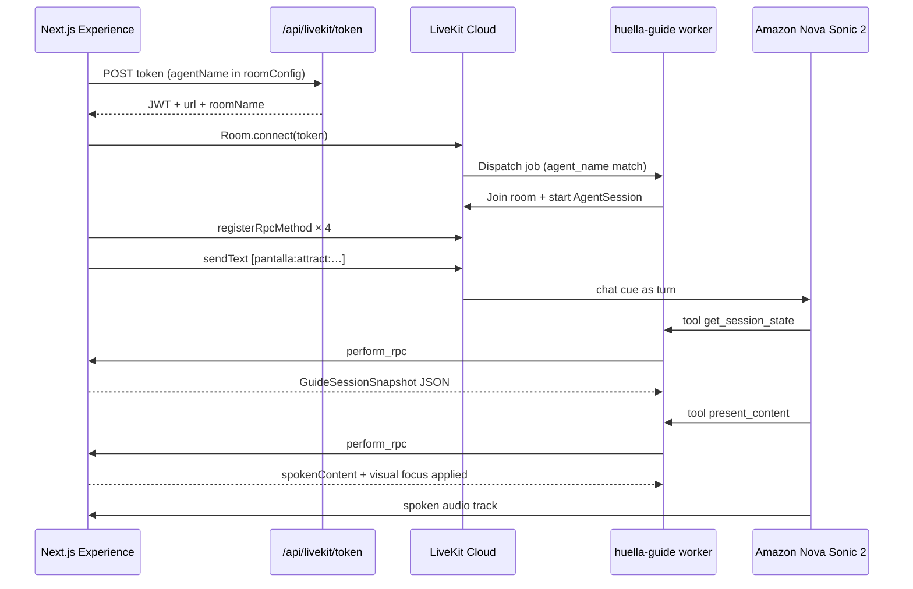

# Huella Digital — Voice ↔ UI Deep Architecture

How the **LiveKit Python agent** (`huella-guide`) connects to the **Next.js kiosk** (`huella-digital`), how the UI/UX is rendered, how voice focuses elements, and how journey business logic works end to end.

Companion quickstart: [README.md](./README.md)  
Product flow narrative: `../docs/design-research/soul.md`

---

## 1. Mental model (read this first)

| Owner | Responsibility |
|-------|----------------|
| **Frontend (`huella-digital`)** | Journey state machine, screens, animations, profile/scores copy, RPC handlers, mic/room join |
| **Python agent (`huella-guide`)** | Hear / speak (Nova Sonic 2), call tools, never invent product text |
| **LiveKit Cloud** | Room, token auth, agent dispatch, audio transport, RPC, `lk.chat` data |

**Contract in one sentence:** the UI is the source of truth; the agent asks “what’s on screen?” and “focus this,” then speaks only the `spokenContent` the UI returns.

```
┌──────────────────┐     LiveKit room      ┌─────────────────────────┐
│  Next.js kiosk   │◄──── audio + RPC ────►│  Python worker          │
│  JourneyState    │     + lk.chat cues    │  Assistant + Nova Sonic │
│  buildPresentation│                      │  perform_rpc → tools    │
└──────────────────┘                       └─────────────────────────┘
```

There is **no Zustand/Redux**. Sync uses:

1. `useReducer` journey machine (`JourneyState`)
2. `guideApiRef` in `Experience` (latest state for RPC)
3. Module-level `sharedRpcHandlers` in `LiveKitRoomAudio`
4. `[pantalla:…]` chat + participant attributes
5. Gesture highlight via DOM `dataset` + `GestureNavContext`

---

## 2. Connection lifecycle (agent ↔ frontend)

### 2.1 Prerequisites

Both sides must share the **same agent name**:

| Side | Variable |
|------|----------|
| Frontend token API | `LIVEKIT_AGENT_NAME` |
| Python worker | `LIVEKIT_AGENT_NAME` (default `huella-guide`) |

Also required: `LIVEKIT_URL`, `LIVEKIT_API_KEY`, `LIVEKIT_API_SECRET` on both; AWS Bedrock keys on the agent.

### 2.2 Token mint + agent dispatch (`on_join`)

File: `huella-digital/src/app/api/livekit/token/route.ts`

1. Client POSTs `/api/livekit/token` (optional `room` / `identity`).
2. Server mints JWT with room join/create + publish/subscribe/data.
3. Token embeds **`RoomConfiguration.agents`** with `RoomAgentDispatch({ agentName })`.
4. Mode is **`dispatchMode: "on_join"`** — the agent is dispatched when the guest joins.

**Critical rule:** do **not** create the room / dispatch the agent *before* the guest connects. If the room already exists, token `roomConfig` agent dispatch is ignored and the agent never joins.

Response:

```json
{
  "token": "…",
  "url": "wss://…",
  "roomName": "huella-session-…",
  "identity": "guest-…",
  "agentName": "huella-guide",
  "dispatchMode": "on_join"
}
```

### 2.3 Client room join

Files:

- `huella-digital/src/components/hud/LiveKitIntroGuide.tsx` — fetches token when voice channel is on
- `huella-digital/src/components/hud/LiveKitRoomAudio.tsx` — `Room.connect`, RPC register, audio

Sequence:

1. User has **voice** enabled (default in `Experience` control channels).
2. `LiveKitIntroGuide` mounts → `fetchSessionToken()`.
3. `LiveKitRoomAudio` creates shared `Room`, connects with token.
4. Registers four RPC methods on the **local (browser) participant**.
5. Starts audio, enables mic, waits for remote participant (the agent).
6. On agent ready → sends first `[pantalla:…]` cue.
7. Shared session uses refcount + short dispose delay (React Strict Mode safe). One auto-retry on connect error with a fresh token.

### 2.4 Python worker join

File: `huella-guide/src/agent.py`

1. Worker runs `uv run python src/agent.py dev|start`.
2. `AgentServer` waits for jobs named `LIVEKIT_AGENT_NAME`.
3. On dispatch: `@server.rtc_session` → build `AgentSession` with Nova Sonic → `session.start(Assistant(), room)` → `ctx.connect()`.
4. Mic audio (noise-enhanced) flows to Nova; agent audio publishes back to the room.
5. Tools call `perform_rpc` on the **first remote participant** (the kiosk guest).

### 2.5 Happy-path timeline



---

## 3. Bidirectional channels

### 3.1 Agent → UI: LiveKit RPC (tools)

Python (`rpc_client.py`):

```python
await room.local_participant.perform_rpc(
    destination_identity=participant.identity,
    method=method,
    payload=json.dumps(payload or {}),
    response_timeout=8.0,
)
```

Frontend (`LiveKitRoomAudio.tsx`):

```ts
room.registerRpcMethod(method, async (data) => {
  const result = await sharedRpcHandlers[method](data.payload ?? "");
  return typeof result === "string" ? result : JSON.stringify(result);
});
```

Handlers are closed over `guideApiRef` in `Experience.tsx` and rebound each render into `sharedRpcHandlers`.

The browser never calls `performRpc` toward the agent for journey control. **Only the agent invokes client tools.**

### 3.2 UI → Agent: `[pantalla:]` cues (`lk.chat`)

File: `notifyGuideScreen` in `LiveKitRoomAudio.tsx`

1. `localParticipant.setAttributes({ huella_step, product: "huella-digital" })`
2. `sendText(\`[pantalla:${step}] ${cue}\`, { topic: "lk.chat" })`

When cues fire:

- Agent becomes ready (current screen)
- `sessionStep` / `sessionCue` change (~350ms debounce) — key includes step **and** phase (`attract:…`, `welcome:ready`, …)
- Manual focus while voice is on (`notifyFocus` from user-driven card/dim changes)

Nova treats this like a turn. Instructions say: on `[pantalla:]` → call `get_session_state`, optionally `present_content`, speak RPC copy. **Do not read the cue string aloud.**

Cue text builders: `buildGuideSessionCue` / `GUIDE_STEP_CUES` in `huella-digital/src/lib/guideScripts.ts` (short nudges; exact lines still come from RPC).

### 3.3 Audio

| Direction | Path |
|-----------|------|
| User → Agent | Browser mic → LiveKit → Nova (with ai_coustics enhancement on the worker) |
| Agent → User | Nova speech → agent track → subscribed in `LiveKitRoomAudio` → speakers |
| Speaking UI | `onAgentSpeaking` → wave / HUD affordances in Experience |

---

## 4. The four client tools (deep)

Catalog: `huella-digital/src/lib/guideTools.ts`  
Handlers: `Experience.tsx` → `guideRpcHandlers`  
Python mirrors: `Assistant` `@function_tool` methods in `agent.py`

### 4.1 `get_session_state`

**Payload:** none / ignored.

**Returns:** full `GuideSessionSnapshot`:

| Field | Meaning |
|-------|---------|
| `step` | `attract` \| `welcome` \| `intro` \| `analysis` \| `detail` \| `recommendations` \| `closing` \| … |
| `phase` | Sub-state label (`ready`, `scanning`, `results`, closing phases, …) |
| `availableActions` | Only these may be passed to `navigate_journey` |
| Indices | `attractTourIndex`, `welcomeStep`, `introCardIndex`, `introDimIndex`, `analysisDimIndex`, `detailSection`, `recommendationIndex` |
| `focusDimensionId` | Active dimension if any |
| `controlChannels` | `{ gesture, voice }` booleans |
| `gestureHighlight` | `"forward"` \| `"back"` \| `null` — pose highlight only, **not** an execute |
| `profile` | name, role, company, gender, industry |
| `content` | scores, process steps, dimension concepts, dimensions detail, plan board |

Built from `buildJourneySnapshot` + live profile/result data + DOM gesture dataset.

**Soft failure:** if the handler throws, RPC returns `{ ok:false, error:"get_session_state_failed", … }` instead of hard-failing Nova.

### 4.2 `present_content` — voice-driven UI focus

**Payload:**

```json
{
  "target": "attract_tour | welcome_preparation | intro_step | intro_dimension | result_dimension | detail_dimension | detail_section | recommendation_item",
  "index": 0,
  "dimensionId": "serp",
  "section": "strengths | opportunities | action_plan"
}
```

(`attract_card` is accepted as an alias of `attract_tour`.)

**Pipeline:**

```
RPC payload
  → applyPresentContent (useJourneyMachine)
  → legacyPresentToEvent → journeyReducer
  → new JourneyState
  → buildPresentation(nextState, profile, resultData)
  → UI props update (controlled / voiceDriven)
  → JSON { ok, spokenContent, narration, title, visualFocus… }
```

**What the agent must speak:** `spokenContent` (and/or `narration` / `title`). Product copy is authored in the frontend presentation layer, not in Python.

### 4.3 `navigate_journey` — business actions

**Payload:** `{ "action": "<JourneyAction>", "dimensionId": "…" }`

Allowed only if `action ∈ availableActions` for the current state; otherwise:

```json
{ "ok": false, "error": "action_not_available", "availableActions": […] }
```

On success: reducer advances; returns `{ ok:true, action, step }`.

Special: `ready_for_picture` also dispatches `window` event `huella:ready-for-picture` for the closing camera flow.

### 4.4 `set_control_channel`

**Payload:** `{ "channel": "voice"|"gesture", "enabled": true|false }`

Updates React `Set` of channels in Experience:

- **voice off** → unmounts LiveKit session (`enabled={guideActive}`)
- **gesture off** → disables MediaPipe gesture nav

---

## 5. How UI / UX is rendered

### 5.1 Single orchestrator

`huella-digital/src/components/Experience.tsx`:

- Owns profile + analysis result data (demo / precomputed for the kiosk)
- Owns `controlChannels`
- Owns journey machine via `useJourneyMachine()`
- Chooses which step view to show
- Passes **controlled** indices when `voiceOn` (`voiceDriven`)

Views (examples):

| Step | View area |
|------|-----------|
| attract | `JourneySteps` / AttractInteractionTour |
| welcome | Welcome preparation + greeting |
| intro | Intro cards + dimension explainer |
| analysis | `AnalysisJourneyView` (scan → score → carousel) |
| detail | Dimension deep-dive sections |
| recommendations | Plan board |
| closing | `ClosingView` (pose → capture → card → thanks) |

### 5.2 Journey state = source of truth

File: `huella-digital/src/journey/types.ts`

UI is a **projection** of `JourneyState`. Voice does not set random CSS; it dispatches events that change state, and React re-renders.

Default graph flags (`flags.ts`):

- `SHOW_NFC_IDENTIFICATION = false` → skip NFC/validation
- `SHOW_REPORT_CONSENT = false` → skip report consent screen

Default path:

```
attract → welcome → intro → analysis → detail → recommendations → closing
```

Optional branches when flags are on: `nfc` / `validation`, `report`.

### 5.3 Voice-driven vs autoplay UX

When voice is on:

- Attract tour / intro **autoplay is off** — agent owns pacing via `present_content`
- Cards use controlled `cardIndex` / dim indices from machine state
- Inactive intro cards can dim (opacity/scale) to show focus
- Gesture highlight uses CSS `[data-gesture-pose]` / `[data-gesture-hit]` — visual only until confirm

When voice is off:

- Local timers / autoplay / touch / gestures can drive progression without LiveKit

### 5.4 Motion / polish

- Framer Motion transitions between steps
- Analysis scan phases, shutter/closing phases
- Agent-speaking wave tied to `onAgentSpeaking`
- Header dock: Mic / Hand toggles (`ControlChannelsDock`)

### 5.5 Known gap

`recommendationIndex` is in state, snapshot, and `spokenContent`, but the plan board may not always receive a spotlight prop from Experience — voice can narrate an item without a strong visual pin. Prefer fixing that in the frontend if product requires strict sync.

---

## 6. Element-by-element: voice → visual focus

`buildPresentation` (`presentation.ts`) maps state → title + `spokenContent` + `visualFocus`.

| `present_content` target | Reducer effect | What the visitor sees / hears |
|--------------------------|----------------|-------------------------------|
| `attract_tour` | `FOCUS_ATTRACT_TOUR` | Hero (`index` −1) or tour cards Gestos / Toque / Voz (0–2); spoken card copy |
| `welcome_preparation` | `SET_WELCOME_STEP` | Prep checklist ticks (1–3); at ready, personalized greeting using profile |
| `intro_step` | `FOCUS_INTRO_STEP` | One of three “Así funciona” cards; narration from `INTRO_GUIDE_STEPS` |
| `intro_dimension` | `FOCUS_INTRO_DIMENSION` | One of five dimension concept slides |
| `result_dimension` | `FOCUS_RESULT_DIMENSION` | Analysis results carousel on a scored dimension |
| `detail_dimension` | `SELECT_DIMENSION` | Enter/switch detail for a dimension id |
| `detail_section` | `SELECT_DETAIL_SECTION` | Strengths / opportunities / action_plan panels |
| `recommendation_item` | `SELECT_RECOMMENDATION` | Plan line index for spoken recommendation |

Python tool args use snake_case (`dimension_id`); RPC JSON uses camelCase (`dimensionId`).

---

## 7. Business logic (journey machine)

### 7.1 Files

| File | Role |
|------|------|
| `journey/types.ts` | `JourneyState` union |
| `journey/events.ts` | `JourneyEvent` |
| `journey/reducer.ts` | Transitions + `availableLegacyActions` |
| `journey/rpcAdapter.ts` | Map RPC action/target → events; phase labels |
| `journey/presentation.ts` | Spoken + visual focus from state |
| `journey/useJourneyMachine.ts` | Hook: `applyLegacyAction`, `applyPresentContent` |
| `journey/flags.ts` | Feature flags + dimension order |
| `journey/commands.ts` | Parallel semantic command catalog (LiveKit path uses legacy actions) |

### 7.2 Allowed actions by step/phase

From `availableLegacyActions`:

| Context | `availableActions` |
|---------|-------------------|
| attract | `start_experience` |
| welcome preparing | `back`, `cancel` |
| welcome ready | `start_experience`, `back`, `cancel` |
| intro | `advance`, `back`, `start_analysis`, `cancel` |
| analysis scanning | `back` |
| analysis complete | `reveal_results`, `back` |
| analysis results | `advance`, `back`, `open_detail`, `send_report` |
| detail / recommendations | `advance`, `back`, `send_report` |
| report (if enabled) | `send_report`, `skip_report`, `back` |
| closing pose | `ready_for_picture`, `back` |
| closing prep | `back` |
| closing thanks | `finish` |

Agent must **not** invent actions outside this list.

### 7.3 Advance / back semantics (summary)

**ADVANCE**

- attract → welcome (or nfc if flag)
- welcome only when `ready` → intro
- intro: steps 0→2, then explain dims 0→4; **last dim does not auto-start analysis** — needs `start_analysis`
- analysis: scanning → complete → results → dims → detail
- detail: walk sections then next dim then recommendations
- recommendations: next item then closing (or report)

**BACK** — reverse within step; from welcome/nfc → attract; closing prep/pose → recommendations.

**start_experience** on attract (machine special-case): may jump via `GO_NFC` or `IDENTITY_READY` depending on NFC flag (skips a bare `BEGIN` in some paths).

**cancel / finish** — reset toward attract / end loop.

### 7.4 Dimensions

Order (`DIMENSION_ORDER`):

1. `serp`
2. `ssi`
3. `arquitectura`
4. `influencia`
5. `higiene`

Scores and long-form detail come from `resultData` / `detailContentForDimension` — demo data for the kiosk experience.

### 7.5 Gesture policy (business + UX)

- Point / scissors highlight forward / back CTAs
- Highlight is **not** execution — agent (or confirm UI) must run `navigate_journey` after spoken confirm
- Exposed to the agent as `gestureHighlight` in `get_session_state`
- Gestures disabled during analysis scan / validation as configured in Experience

---

## 8. What the Python agent does *not* own

| Concern | Where it lives |
|---------|----------------|
| Screen graph & transitions | Frontend reducer |
| Exact spoken lines | `buildPresentation` / content libs |
| Profile & scores | Experience + analysis data |
| Which button is legal | `availableLegacyActions` |
| Camera shutter / card generate | ClosingView + window events |
| Attract card copy | `AttractInteractionTour` / presentation |

The agent’s job: listen, call tools in order, speak returned text, stay in Spanish, stay on-experience.

Legacy `huella-guide/src/tasks/*` still encodes an older auto-tour choreography (attract tour → welcome → …) via `AgentTask` handoffs. **Current production entrypoint does not use them.** They remain useful as a phase playbook and for tests.

---

## 9. Typical conversational beats

### Attract

1. Cue `[pantalla:attract:…]`
2. `get_session_state` → `availableActions: ["start_experience"]`
3. `present_content` hero and/or cards 0–2
4. User confirms start → `navigate_journey({ action: "start_experience" })`

### Welcome

1. Prep targets via `welcome_preparation` indices
2. When phase `ready`, greet using profile from snapshot / presentation
3. Confirm → `start_experience` again (now meaning “enter intro”)

### Intro

1. `intro_step` 0–2, then `intro_dimension` 0–4
2. User ready for analysis → `start_analysis` (not silent ADVANCE off the last dim)

### Analysis → detail → plan → closing

1. During scan, limited actions; after complete → `reveal_results`
2. Tour `result_dimension`; open detail with `open_detail` + `dimensionId`
3. Sections via `detail_section`
4. Recommendations / closing; pose → spoken confirm → `ready_for_picture`
5. Thanks → `finish`

---

## 10. Failure modes & operational notes

| Symptom | Likely cause |
|---------|----------------|
| Agent never joins | Room created before guest join; or `LIVEKIT_AGENT_NAME` mismatch; worker not running |
| Tools fail “no participant” | Agent joined before browser, or browser left |
| Bedrock ValidationException | Prompt wording tripped RAI — keep Nova instructions short / neutral |
| Agent invents scores | Model ignored tools — reinforce spokenContent-only; check RPC returns |
| Voice on but silent UI | Cue not sent / Nova waiting — check `[pantalla:]` logs and agent ready |
| Action rejected | Agent called action not in `availableActions` |

Logging:

- Frontend: `[livekit/token]`, `[LiveKitRoomAudio] notified agent of screen`
- Agent: `ctx.log_context_fields` with room, `voice_backend=nova`, `nova_voice`

---

## 11. File map (both repos)

### Agent — `huella-guide`

| Path | Role |
|------|------|
| `src/agent.py` | Server, Nova session, Assistant tools |
| `src/rpc_client.py` | `perform_rpc` helper |
| `src/tasks/*` | Legacy phase tasks (unused live) |
| `.env.example` | LiveKit + AWS + Nova voice |
| `livekit.toml` | Cloud project / agent id |
| `README.md` | Python build walkthrough |

### Frontend — `huella-digital`

| Path | Role |
|------|------|
| `src/app/api/livekit/token/route.ts` | Token + on_join dispatch |
| `src/components/Experience.tsx` | Orchestrator + RPC handlers |
| `src/components/hud/LiveKitIntroGuide.tsx` | Token + mount room when voice on |
| `src/components/hud/LiveKitRoomAudio.tsx` | Connect, RPC register, cues, audio |
| `src/lib/guideTools.ts` | Method names + snapshot types |
| `src/lib/guideScripts.ts` | Cues + optional Builder instructions |
| `src/journey/*` | State machine, presentation, adapters |
| `src/components/hud/JourneySteps.tsx` | Attract / welcome / intro / closing chrome |
| `src/components/hud/AnalysisJourneyView.tsx` | Analysis UI |
| `src/components/hud/GestureNav.tsx` | Gesture highlight / CTAs |
| `src/components/hud/Header.tsx` | Control channel dock |

---

## 12. Design principles (why it’s built this way)

1. **Latency** — short Nova prompt; product text in RPC; max 4 tool steps.
2. **UI-first truth** — voice cannot desync from screen if it only speaks returned copy.
3. **Small tool surface** — four semantic tools beat dozens of low-level DOM tools.
4. **Confirm before mutate** — especially capture / send / finish; gestures highlight only.
5. **Same contract for Builder** — Agent Builder docs mirror the same RPC names for experiments without replacing the Python worker.

---

*Last aligned with the Nova Sonic single-agent path in `huella-guide/src/agent.py` and the journey machine in `huella-digital/src/journey/`.*
